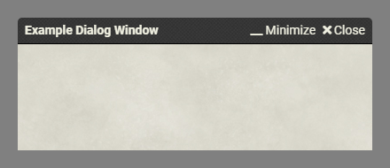

# Foundry VTT – Minimize-Button
A small Foundry VTT Module that adds a minimize button to the top of windows, instead of having to use the hidden double-click title to minimize feature.

## Installation
Initial proof-of-concept release; please report any bugs, issues, or suggestions on the [issues tracker](https://github.com/bluesatin/foundry-vtt-minimize-button/issues).

The module is available on the Foundry VTT module finder, or alternatively you can manually install the module by using the module.json URL:  
`https://github.com/bluesatin/foundry-vtt-minimize-button/releases/latest/download/module.json`

Once installed and activated in your world, you should have minimize buttons added to the top of any windows that are minimizable.

## Preview
| Initial Release Screenshot |
|----|
|  |
